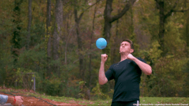
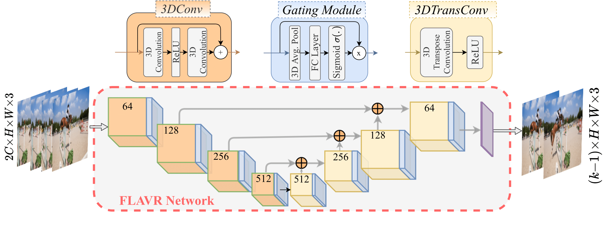

# FLAVR: 流无关视频表示用于快速帧插值
## WACV 2023（最佳论文决赛入围）




[[项目页面](https://tarun005.github.io/FLAVR/)] [[论文](https://arxiv.org/pdf/2012.08512.pdf)] [[项目视频](youtu.be/HFOY7CGpJRM)]

FLAVR 是一种快速、无流的帧插值方法，能够进行单次多帧预测。它使用定制的编码器-解码器架构，结合时空卷积和通道门控，捕捉和插值帧之间复杂的运动轨迹，以生成逼真的高帧率视频。该存储库包含原始源代码。

## 推理时间

FLAVR 在速度和准确性之间提供了比以前的帧插值方法更好的权衡。

| 方法        | 512x512 图像的 FPS（秒） |
| ------------- |:-------------:|
| FLAVR       | 3.10  |
| SuperSloMo | 3.33 |
| QVI      |   1.02  |
| DAIN |   0.77  |

## 依赖项

我们使用以下工具来训练和测试模型。

- Ubuntu 18.04
- Python==3.7.4
- numpy==1.19.2
- [PyTorch](http://pytorch.org/)==1.5.0, torchvision==0.6.0, cudatoolkit==10.1

## 模型

<center></center>

## 在 Vimeo-90K 七元组上训练模型

要在 Vimeo-90K 数据集上训练自己的模型，请使用以下命令。您可以从 [此链接](http://toflow.csail.mit.edu/) 下载数据集。论文中报告的结果是使用 8 个 GPU 训练的。
```bash
python main.py --batch_size 32 --test_batch_size 32 --dataset vimeo90K_septuplet --loss 1*L1 --max_epoch 200 --lr 0.0002 --data_root <dataset_path> --n_outputs 1
```

在 GoPro 数据集上训练类似，只需将 `n_outputs` 更改为 7 以进行 8 倍插值。

## 使用训练模型进行测试

### 训练模型
您可以从以下链接下载预训练的 FLAVR 模型。
| 方法        | 训练模型  |
| ------------- |:-----|
| **2x** | [链接](https://drive.google.com/file/d/1IZe-39ZuXy3OheGJC-fT3shZocGYuNdH/view?usp=sharing) |
| **4x** |   [链接](https://drive.google.com/file/d/1GARJK0Ti1gLH_O0spxAEqzbMwUKqE37S/view?usp=sharing)   |
| **8x** |   [链接](https://drive.google.com/file/d/1xoZqWJdIOjSaE2DtH4ifXKlRwFySm5Gq/view?usp=sharing)  |

### 2x 插值
要在 Vimeo-90K 七元组验证集上测试预训练模型，您可以运行以下命令：
```bash
python test.py --dataset vimeo90K_septuplet --data_root <data_path> --load_from <saved_model> --n_outputs 1
```

### 8x 插值
要测试多帧插值模型，请使用与上述相同的命令，使用多帧 FLAVR 模型，并相应地更改 `n_outputs`。

### 时间基准测试
测试脚本除了计算 PSNR 和 SSIM 值外，还将输出插值的推理时间和速度。

### 在 Middleburry 上评估

要在 Middleburry 的公共基准上进行评估，请运行以下命令。
```bash
python Middleburry_Test.py --data_root <data_path> --load_from <model_path> 
```

插值图像将保存到 `Middleburry` 文件夹中，格式可以直接上传到 [排行榜](https://vision.middlebury.edu/flow/eval/results/results-i2.php)。

## 在自定义视频上使用 SloMo-Filter
您可以使用我们的训练模型并在自己的视频上应用慢动作滤镜（需要 OpenCV 4.2.0）。使用以下命令。如果您想将 30FPS 视频转换为 240FPS 视频，只需使用命令
```bash
python interpolate.py --input_video <input_video> --factor 8 --load_model <model_path>
```
使用我们的 [预训练模型](https://drive.google.com/file/d/1xoZqWJdIOjSaE2DtH4ifXKlRwFySm5Gq/view?usp=sharing) 进行 8 倍插值。要将 30FPS 视频转换为 60FPS 视频，请使用 2x 模型，`factor` 设置为 2。

## 基线模型
我们还为许多其他先前的工作在我们的设置中训练模型，并提供所有这些方法的模型。完整的基准测试脚本也将很快发布。

**新 [2024年4月]**：由于谷歌对 UCSD 的谷歌驱动器配额的惊人减少，我失去了对以下列出的其他方法的预训练模型的访问权限。我希望重新训练它们并在未来发布新链接，但不要指望它。抱歉！

| 方法        | Vimeo 上的 PSNR           | 训练模型  |
| ------------- |:-------------:| -----:|
| FLAVR       | 36.3    | [模型](https://drive.google.com/file/d/1IZe-39ZuXy3OheGJC-fT3shZocGYuNdH/view?usp=sharing) |
| AdaCoF      | 35.3 | [模型](https://drive.google.com/file/d/19Y2TDZkSbRgNu-OItvqk3qn5cBWGg1RT/view?usp=sharing) |
| QVI*      |   35.15    | [模型](https://drive.google.com/file/d/1v2u5diGcvdTLhck8Xwu0baI4zm0JBJhI/view?usp=sharing)   |
| DAIN |   34.19   | [模型](https://drive.google.com/file/d/1RfrwrHoSX_3RIdsoQgPg9IfGAJRhOoEp/view?usp=sharing)  |
| SuperSloMo* | 32.90 | [模型](https://drive.google.com/file/d/1dR2at5DQO7w5s2tA5stC95Nmu_ezsPth/view?usp=sharing)

* SuperSloMo 是使用 [这里](https://github.com/avinashpaliwal/Super-SloMo) 的代码库实现的。其他基线是使用官方代码库实现的。
* 这里呈现的基线数字略高于论文中报告的数字。

## Google Colab
一个 Colab 笔记本可以在自定义视频上尝试 2x 慢动作滤镜，位于该存储库的 *notebooks* 目录中。

## 用于运动放大模型
不幸的是，我们目前无法提供运动放大训练模型。我们正在努力尽快提供一个可用的模型。

## 致谢
该代码大量借鉴了 Facebook 的官方 [PyTorch 视频存储库](https://github.com/facebookresearch/VMZ) 和 [CAIN](https://github.com/myungsub/CAIN)。

## 引用
如果这段代码对您的工作有所帮助，请考虑引用我们。